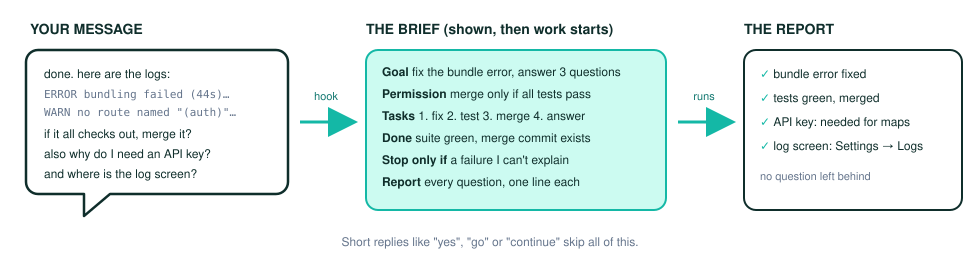
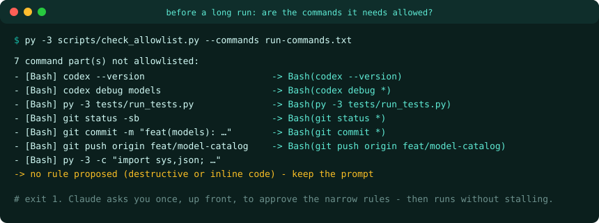
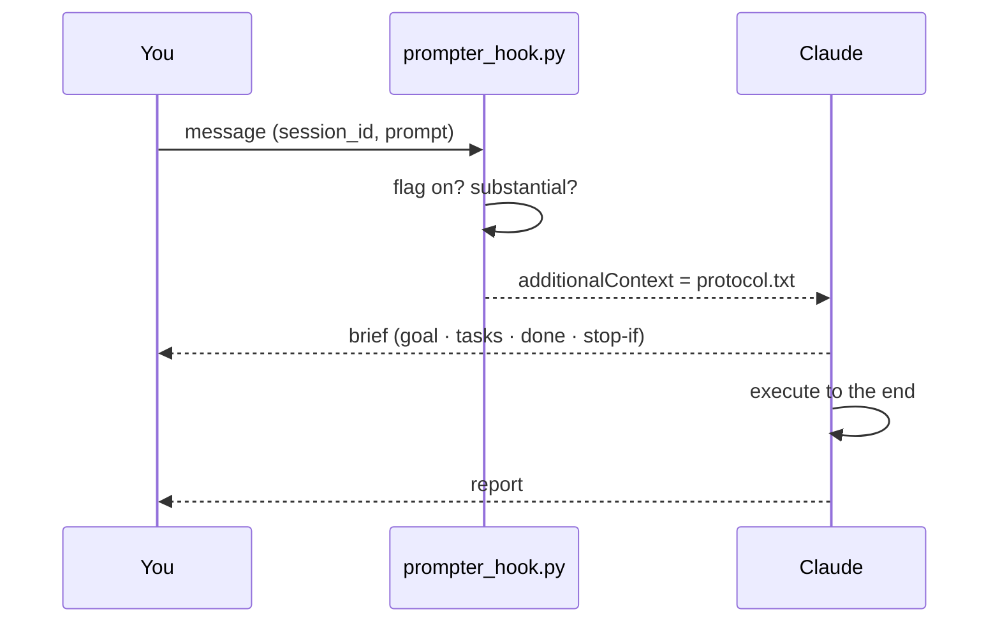

<div align="center">

# 🎯 prompter

**A Claude Code session mode that turns messy prompts into a brief Claude can run to the end.**
Type `/prompter` once. Every long message, pasted report or question gets rebuilt into a goal-oriented brief before Claude acts, and then Claude acts on it.

[](#quick-start)
[](#quick-start)
[](#verify)
[](LICENSE)

</div>

---

## TL;DR

Type **`/prompter`** in a Claude Code session and keep talking as usual. A `UserPromptSubmit` **hook** attaches a short protocol to every substantial message, so Claude first shows a **3-6 line brief** (goal, permission, ordered tasks, measurable "done", stop conditions, report format) and then works to the end in the same turn. Your original message is never changed or cut: Claude reads all of it, logs included, and the final report answers **every question** in it. Before a long run it also checks that the shell commands the run needs are **allowlisted**, so the auto-mode safety check doesn't end the turn. `prompter off` turns it off.

<p align="center">
  
</p>

---

## Why

A real transcript scan (details in [docs/design.md](docs/design.md)) found agents stopping early for two reasons:

| 🔥 What went wrong | 🕒 Found | 💸 Cost |
|---|---|---|
| The prompt ended in a question, so the agent asked "want me to…?" | workflowai-factory, 2026-08-23 | a nudge, then a restart |
| The permission was conditional ("if everything checks out… I would like us to"), so no merge happened | real-estate CRM, 2026-09-23 | the merge waited for the next turn |
| Several questions were mixed into a pasted report, so the agent answered and handed the choice back | workflowai-factory, 2026-09-22 | a manual "fix all" |
| 5 shell commands got "no verdict" from the auto-mode check, so the turn ended | workflowai-factory, 2026-09-29 | an overnight run stalled |
| With prompter on, a long message with logs and 4 questions got a brief that had no task for one question ("Refresh log - where?") | BroFix, 2026-10 | a question could go unanswered |

The brief fixes the first three: permission is explicit, the tasks are ordered, and "done" is measurable. `check_allowlist.py` catches the fourth before the run starts. Rule 7 catches the fifth: the report closes every question and item from the original message.

---

## ✨ Features

- **Per-session mode.** `/prompter` writes `~/.claude/prompter/active/<session_id>`; other sessions are unaffected.
- **Only substantial messages.** A message counts when it is ≥ 300 chars, ≥ 5 lines, or a question. `yes`, `go`, `continue` and `/commands` pass through.
- **Visible brief, no waiting.** Claude shows the brief and starts in the same turn.
- **Nothing dropped.** Before the report, Claude re-reads your original message, answers every question one line each, and ticks off every item (rule 7 in `protocol.txt`).
- **Never adds authority.** Push, merge, delete and deploy happen only if you said so. Conditional permission becomes a testable condition.
- **Allowlist check.** `scripts/check_allowlist.py` splits compound commands, matches them against your settings, and proposes narrow rules. It refuses to propose rules for destructive commands or inline `-c` code.
- **Fails safe.** The hook always exits 0 and prints nothing on bad input, so it never blocks a prompt.

---

## 🚀 Quick start

```powershell
# 1. link the skill (Windows junction)
New-Item -ItemType Junction -Path "$HOME\.claude\skills\prompter" -Target "C:\Users\tzaru\Documents\AI Development OS\prompter"

# 2. register the hook: add this under "hooks" in ~/.claude/settings.json
#    "UserPromptSubmit": [{ "hooks": [{ "type": "command",
#      "command": "py -3 \"C:/Users/tzaru/Documents/AI Development OS/prompter/hooks/prompter_hook.py\"",
#      "timeout": 5 }] }]

# 3. verify
py -3 -m unittest discover tests      # Ran 26 tests ... OK

# 4. first run: in a new Claude Code session
/prompter
```

<details>
<summary><b>Codex, Cursor, WSL</b></summary>

| Platform | Status |
|---|---|
| Codex | not in v1; no equivalent per-message hook has been checked yet |
| Cursor | not in v1 |
| WSL | not in v1; the hook path above is Windows |

</details>

---

## 🧭 Usage

| Command | What happens |
|---|---|
| `/prompter` | Turns the mode on for this session. Claude replies with one line. |
| any long message or question | Claude shows the brief, then works to the end. |
| `yes` / `go` / `continue` | Passes through untouched. |
| `prompter off` or `/prompter off` | Turns the mode off for this session. |
| `py -3 scripts/check_allowlist.py --commands cmds.txt` | Lists the commands that aren't allowlisted and the rules it proposes (exit 1 if any are missing). |

### What the allowlist check looks like

<p align="center">
  
</p>

```bash
py -3 scripts/check_allowlist.py --commands tests/fixtures/case5-commands.txt --settings tests/fixtures/case5-settings-before.json
```

---

## ⚙️ How it works



1. **A hook, not a rewrite.** A hook can't replace your text, but it can attach instructions before Claude reads it. Claude rebuilds the message as a visible brief.
2. **Two causes, two fixes.** The brief fixes prompt-shaped stops. The allowlist check fixes harness-shaped stops.
3. **The original stays the source.** The brief steers the work; the report is checked against your full message.
4. **One up-front question at most.** Gaps get filled from files first. Anything only you can answer is asked once, before work starts.

| # | Part | Takes | Produces |
|---|---|---|---|
| 1 | `hooks/prompter_hook.py` | hook input JSON on stdin | `additionalContext`, or nothing |
| 2 | `protocol.txt` | — | the injected rules (short form) |
| 3 | `SKILL.md` | `/prompter` | the full protocol, with an example |
| 4 | `scripts/check_allowlist.py` | command list + settings files | missing parts + proposed rules |

---

## 🗂 Repository map

```
SKILL.md                      skill: trigger, full protocol, example
protocol.txt                  text the hook injects
hooks/prompter_hook.py        UserPromptSubmit hook
scripts/check_allowlist.py    allowlist checker (read-only)
tests/                        unittest suites
tests/fixtures/               6 real prompts (cases 1-6), case-5 commands and settings
docs/design.md                evidence and decisions
docs/evals.md                 model-behaviour eval protocol and results
docs/assets/                  README images
```

---

## 🧪 Verify

```bash
py -3 -m unittest discover tests
```

The tests prove the hook's on/off handling, per-session isolation, the short-reply pass-through, and its silent handling of bad input. They also prove that the checker flags the real case-5 commands against the old settings and clears them against the new ones. How the model actually behaves is checked separately with [docs/evals.md](docs/evals.md): headless `claude -p` runs in plan mode on the real prompts, including the case-6 "answer every question" check.

---

## 🧩 Extend

- **Change what counts as substantial:** `substantial()` in `hooks/prompter_hook.py`, plus `tests/test_hook.py`.
- **Change the rules Claude follows:** `protocol.txt` and `SKILL.md` together, then rerun `docs/evals.md`.
- **Add a destructive-command pattern:** `DESTRUCTIVE` in `scripts/check_allowlist.py`, plus `tests/test_check_allowlist.py`.

---

## ❓ FAQ

**Does it change my message?** No. Your text reaches Claude unchanged; the hook only adds context next to it.

**Does Claude still see my logs and pasted text, or only the brief?** All of it. The brief is Claude's own summary. The original stays the source, and the report has to answer every question in it.

**Does it edit settings or grant permissions?** No. `check_allowlist.py` only reads settings and proposes rules, and you approve any change.

**Does it add push/merge/deploy on its own?** No. The brief never widens what you said.

**Does it slow down short replies?** No. They pass through, and the hook adds nothing.

**What if the hook isn't registered?** The skill tells Claude to apply the protocol by itself for the rest of the session and to say that the hook is missing.

**Does it survive compaction and resume?** Compaction, yes: the hook runs on every message. For resume, if a resumed session gets a new `session_id`, type `/prompter` again.

---

## 📄 License

[MIT](LICENSE) © 2026 Eran Tzarum
