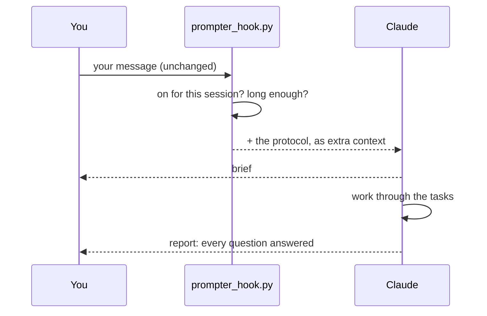

<div align="center">


# prompter

**Say it messy. Get it finished.**
A Claude Code mode that turns every long, tangled message into a short plan, then works it through to the end.

[](#install)
[](#install)
[](#verify)
[](LICENSE)

</div>

---

## At a glance

| You do | prompter does | You get |
|---|---|---|
| Type `/prompter` once, then talk like you always do | Before Claude acts, it writes a 3-6 line **brief**: goal, permission, ordered tasks, what "done" means, when to stop | Work that runs to the end, and a report that answers **every question** you asked |

<p align="center">
  
</p>

---

## Why

You paste logs, mix in three questions, and add "if it all checks out, merge it". Claude does part of the work, then stops to ask *"want me to…?"*. You type "yes", and it happens again.

A scan of a few hundred real agent sessions found the same few causes behind most of these stops:

| Why the agent stopped | What prompter changes |
|---|---|
| The message ended in a question, so the agent answered it and handed the decision back | The brief states what you allowed and what "done" means |
| Permission was conditional ("if everything checks out…") and nothing was measurable | "Merge only if the full test suite passes" |
| Several goals were mixed into one long paste with no order | An ordered, bounded task list |
| A side question got lost in a long message with logs | The report answers every question, one line each |
| Shell commands were blocked by the permission check until the turn ended | Before a long run, it checks the commands are allowlisted and asks you once |

---

## What it does

- 🎚️ **On for one session.** `/prompter` turns it on; `prompter off` turns it off. Other sessions don't notice.
- 🧹 **Only when it helps.** Long messages, pastes and questions get a brief. `yes`, `go` and `continue` don't.
- 📝 **Shows the plan, doesn't wait.** The brief comes first, then work starts in the same turn.
- ✅ **Nothing dropped.** Your original message stays the source. The final report closes every question and item in it.
- 🛡️ **Never adds permission.** Push, merge, delete and deploy happen only if you said so.
- 🔑 **No surprise stalls.** `scripts/check_allowlist.py` finds the shell commands a long run needs that your settings don't allow yet. It proposes narrow rules and never writes them itself.

---

## Install

```bash
# 1. get the skill into Claude Code's skill folder
git clone https://github.com/EranTzarum/prompter.git ~/.claude/skills/prompter

# 2. verify
cd ~/.claude/skills/prompter && python3 -m unittest discover tests   # expected: Ran 29 tests ... OK

# 3. register the hook: add this to "hooks" in ~/.claude/settings.json
#    "UserPromptSubmit": [{ "hooks": [{ "type": "command",
#       "command": "python3 ~/.claude/skills/prompter/hooks/prompter_hook.py", "timeout": 5 }] }]
```

> [!TIP]
> On Windows, use `py -3` instead of `python3`, and write the hook path with forward slashes in quotes.

Then open a new session and type `/prompter`. Claude replies with one line saying it's on.

To have it on in every new session, type `/prompter always` once. `/prompter always off` undoes it, and `prompter off` still turns it off for a single session.

---

## Try it

You send this (a typical end-of-day message):

```text
done with step 1. logs below:
  ERROR web bundling failed: cannot resolve ./worker.wasm
  WARN  no route named "(auth)" in layout
if everything checks out and tests pass, merge it.
also - why do I need a maps API key? and where is the "refresh log" button?
```

Claude answers with a brief, then starts working:

```text
Goal:         fix the web bundle error and the route warning, merge, answer 2 questions
Permission:   merge to main only if the full test suite passes; no deploy
Tasks:        1. fix bundle  2. fix route  3. run tests  4. merge  5. answer questions
Done:         suite green, merge commit on main
Stop only if: a failing test I can't explain
Report:       what changed, test result, merge commit, one line per question
```

The final report ends with one line for the API key and one for the refresh button. Nothing you asked gets skipped.

### Before a long run

<p align="center">
  
</p>

```bash
python3 scripts/check_allowlist.py --commands run-commands.txt
```

---

## How it works



1. **A hook adds, never edits.** Claude Code runs the hook before it reads your message. The hook attaches the rules next to your text; your text arrives untouched.
2. **Two kinds of stop, two fixes.** The brief handles stops caused by how a message is written. The allowlist check handles stops caused by permissions.
3. **One question at most, up front.** Gaps get filled from the repo first. Anything only you can decide is asked once, before work starts.

| Part | Takes | Produces |
|---|---|---|
| `hooks/prompter_hook.py` | your message and session id | the protocol as extra context, or nothing |
| `protocol.txt` | — | the 7 rules Claude follows |
| `SKILL.md` | `/prompter` | the full rules, with an example |
| `scripts/check_allowlist.py` | a command list + your settings | what's blocked, and narrow rules to allow it |

---

## Verify

```bash
python3 -m unittest discover tests
```

The tests prove the on/off switch, that sessions stay separate, that short replies pass through, and that bad input never blocks a prompt. They also prove the allowlist check catches compound commands and refuses risky ones.

> [!NOTE]
> Unit tests can't judge what Claude writes. [docs/evals.md](docs/evals.md) has the model-level checks: headless runs on anonymized real prompts.

---

## Extend

- **Change what counts as "long enough":** `substantial()` in `hooks/prompter_hook.py`, plus `tests/test_hook.py`.
- **Change the rules:** edit `protocol.txt` and `SKILL.md` together, then rerun [docs/evals.md](docs/evals.md).
- **Add a risky-command pattern:** `DESTRUCTIVE` in `scripts/check_allowlist.py`, plus `tests/test_check_allowlist.py`.

---

## FAQ

<details><summary><b>Does it change what I wrote?</b></summary>

No. Your message reaches Claude exactly as typed. The hook only adds context next to it.
</details>

<details><summary><b>Does Claude still read my logs and pasted text, or only the brief?</b></summary>

All of it. The brief is Claude's own summary; your full message stays the source for the final report.
</details>

<details><summary><b>Can it push, merge or deploy on its own?</b></summary>

No. The brief never adds permission you didn't give, and the allowlist check only proposes rules.
</details>

<details><summary><b>Will it slow down quick replies?</b></summary>

No. Short replies pass straight through.
</details>

<details><summary><b>What if I forget to register the hook?</b></summary>

The skill tells Claude to follow the rules on its own for the session and to tell you the hook is missing.
</details>

<details><summary><b>Does it work in Codex or Cursor?</b></summary>

Not as a hook: it relies on Claude Code's per-message hook, and neither has one. For Codex there is an experimental manual variant: paste [`codex/AGENTS-snippet.md`](codex/AGENTS-snippet.md) into `~/.codex/AGENTS.md`. The same rules apply, but Codex decides by itself when a message is substantial, so it is less reliable than the hook. Feedback welcome.
</details>

---

## License

[MIT](LICENSE) © 2026 Eran Tzarum

<div align="center"><sub>For agents that should finish what they start.</sub></div>
